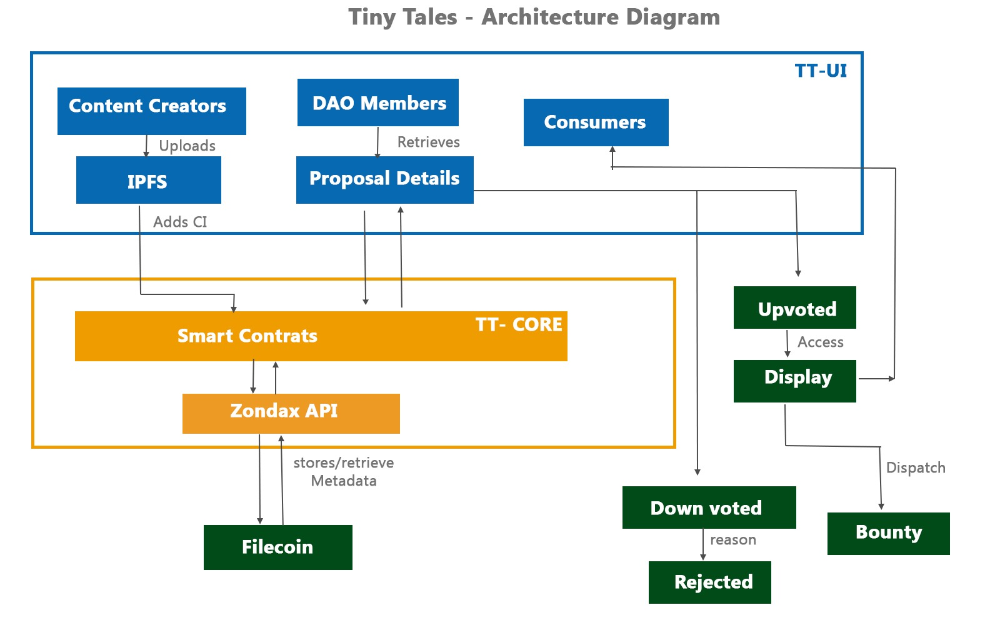

# frontend
Tinytales - A kid safe learning platform. User interface based on React/Next.js


# Welcome to TinyTales
**TinyTales** -  A kid safe DataDAO based on FEVM. TinyTales represents a new and innovative approach to kids safe content.

## Problem Statement

To provide a secure and trustworthy environment for children to learn, grow, and connect with others. TinyTales provides a safe and secure environment for children to explore and learn, free from exposure to harmful or inappropriate content.


## Application Design Document


## Our solution
A DataDAO that provides a safe and secure environment for children to explore and learn, free from exposure to harmful or inappropriate content.

## How It's Made

###### Architecture

- core - Smart contracts incorporating DAO onboarding and governance.
- frontend - Next.js/TypeScript based frontend dApp
- FEVM - Easy and Ethereum compatible VM for deploying contracts
- Zondax - Filecoin Solidity API
- Testnets - Hyperspace/Wallaby

###### Technologies

- UI - Next.js, React, HTML/Tailwind CSS
- Smart Contracts - Solidity deployed on FEVM
- Backend - TypeScript
- Testnet - Wallaby/Hyperspace
- Tools - Hardhat, Remix, Metamask
- CI/CD - ArgoApp/Spheron Protocol
- Art Design - Adobe PhotoShop, Adobe Illustrator

## Related source code repo

* dApp - https://github.com/tinytaless/frontend
* Smart Contracts - https://github.com/tinytaless/core

## Developers
* Ram Vittal (ramvittal@gmail.com)

## How to setup and run TinyTales UI
```
 git clone https://github.com/tinytaless/frontend.git
 yarn install
 yarn build
 yarn start

```

## References
* https://docs.filecoin.io/fvm
* https://docs.zondax.ch/fevm/filecoin-solidity/
* https://github.com/filecoin-project/testnet-hyperspace
* https://rfs.fvm.dev/
